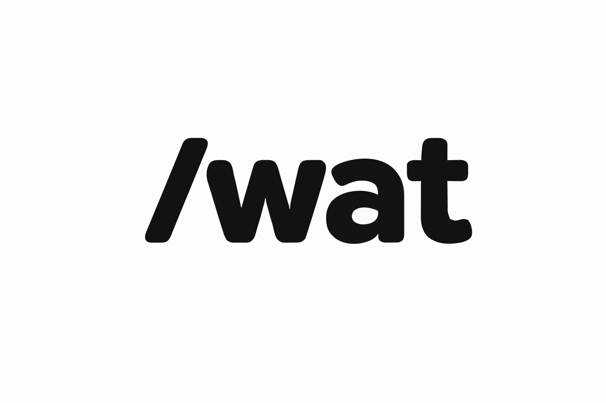

<div align="center">
  

  # Well-Architected Terraform (`wat`)

  [](https://github.com/ilijad1/well-architected-terraform/actions/workflows/ci.yml)
  [](https://goreportcard.com/report/github.com/ilijad1/well-architected-terraform)
  [](LICENSE)

  **Blazing fast** Terraform analyzer that validates infrastructure code against cloud provider Well-Architected Framework best practices — **Security**, **Reliability**, **Operational Excellence**, **Performance Efficiency**, **Cost Optimization**, and **Sustainability**.

  Built for **development workflows** and **CI/CD pipelines**.
</div>

**Currently supports AWS** | Azure and GCP coming soon

---

## Features

- **Cross-resource validation** — Checks relationships between resources (e.g., every S3 bucket has a public access block, CloudTrail logs to CloudWatch, Lambda functions have dedicated log groups)
- **Single-resource checks** — Validates individual resource configurations against best practices
- **Fast & local** — Analyzes `terraform show -json` plan output with no cloud API calls
- **Multi-cloud ready** — Architected for AWS (available now), Azure and GCP (coming soon)
- **All 6 Well-Architected pillars** — Security, Reliability, Operational Excellence, Performance Efficiency, Cost Optimization, Sustainability
- **CI/CD native** — GitHub Action included, SARIF output for code scanning, exit codes for pipeline gating
- **Developer friendly** — Runs locally, multiple output formats (CLI, JSON, Markdown, SARIF, JUnit, CSV)
- **Suppressions** — Silence known-good deviations with optional expiry dates
- **Flexible filtering** — Filter by pillar, severity, or exclude specific rules

---

## Installation

### Pre-built binaries (recommended)

Download from the [Releases page](https://github.com/ilijad1/well-architected-terraform/releases) for Linux, macOS (Intel + Apple Silicon), and Windows.

```bash
# macOS (Apple Silicon)
curl -L https://github.com/ilijad1/well-architected-terraform/releases/latest/download/wat_linux_arm64.tar.gz | tar -xz
mv wat /usr/local/bin/

# Linux (x86_64)
curl -L https://github.com/ilijad1/well-architected-terraform/releases/latest/download/wat_linux_amd64.tar.gz | tar -xz
mv wat /usr/local/bin/
```

### go install

```bash
go install github.com/ilijad1/well-architected-terraform@latest
```

### From source

```bash
git clone https://github.com/ilijad1/well-architected-terraform
cd well-architected-terraform
make install   # installs to $GOPATH/bin or ~/go/bin
```

### Docker

```bash
# Pull from GitHub Container Registry
docker pull ghcr.io/ilijad1/well-architected-terraform:v0.1.0

# Or build locally
git clone https://github.com/ilijad1/well-architected-terraform
cd well-architected-terraform
docker build -t wat .

# Run analysis
docker run --rm -v $(pwd):/workspace ghcr.io/ilijad1/well-architected-terraform:v0.1.0 analyze plan.json
```

---

## Local Development

### Prerequisites

- Go 1.23 or later
- Git

### Setup

```bash
# Clone the repository
git clone https://github.com/ilijad1/well-architected-terraform
cd well-architected-terraform

# Install dependencies
go mod download

# Build the binary
make build

# Run tests
make test

# Run linters
make lint

# Install globally
make install
```

### Development Commands

```bash
make build        # Build the wat binary
make test         # Run all tests (verbose)
make test-short   # Run all tests (quiet)
make lint         # go vet ./...
make install      # Install to $GOPATH/bin

./wat list-rules                    # Verify all rules loaded
./wat list-rules --pillar Security  # Filter by pillar
./wat list-rules | wc -l            # Count rules
```

---

## Quick Start

```bash
# Generate a Terraform plan
terraform plan -out=plan.bin
terraform show -json plan.bin > plan.json

# Analyze the plan
./wat analyze plan.json
```

Example output:

```
FINDING  EC2-001  HIGH  Security  aws_instance.web
  EC2 instance does not use IMDSv2. Instance metadata service v1 is
  vulnerable to SSRF attacks.
  Remediation: Set metadata_options { http_tokens = "required" }

...

Summary: 12 findings (2 CRITICAL, 5 HIGH, 3 MEDIUM, 2 LOW)
```

---

## Usage

```bash
# Basic analysis
./wat analyze plan.json

# Filter by pillar
./wat analyze --pillar Security plan.json
./wat analyze --pillar Sustainability plan.json

# Filter by minimum severity
./wat analyze --min-severity HIGH plan.json

# Fail with exit code 1 if any HIGH or CRITICAL findings exist (for CI/CD)
./wat analyze --fail-on HIGH plan.json

# Output formats
./wat analyze --format json plan.json
./wat analyze --format markdown -o report.md plan.json
./wat analyze --format sarif -o results.sarif plan.json
./wat analyze --format junit -o test-results.xml plan.json
./wat analyze --format csv -o findings.csv plan.json

# Use a suppression config
./wat analyze --config .wat.yaml plan.json

# List all registered rules
./wat list-rules
./wat list-rules --pillar Sustainability
./wat list-rules --pillar Security

# Version info
./wat version
```

---

## Docker Usage

Run `wat` in a container without installing Go or the binary locally:

```bash
# Pull the multi-arch image (supports amd64 and arm64)
docker pull ghcr.io/ilijad1/well-architected-terraform:v0.1.0

# Basic analysis (mount current directory as /workspace)
docker run --rm -v $(pwd):/workspace ghcr.io/ilijad1/well-architected-terraform:v0.1.0 analyze plan.json

# On SELinux systems (Fedora, RHEL, CentOS), add :z flag
docker run --rm -v $(pwd):/workspace:z ghcr.io/ilijad1/well-architected-terraform:v0.1.0 analyze plan.json

# With output formats
docker run --rm -v $(pwd):/workspace ghcr.io/ilijad1/well-architected-terraform:v0.1.0 analyze --format json plan.json
docker run --rm -v $(pwd):/workspace ghcr.io/ilijad1/well-architected-terraform:v0.1.0 analyze --format sarif -o results.sarif plan.json

# Filter by pillar or severity
docker run --rm -v $(pwd):/workspace ghcr.io/ilijad1/well-architected-terraform:v0.1.0 analyze --pillar Security --fail-on HIGH plan.json

# List rules
docker run --rm ghcr.io/ilijad1/well-architected-terraform:v0.1.0 list-rules
docker run --rm ghcr.io/ilijad1/well-architected-terraform:v0.1.0 list-rules --pillar Sustainability

# Use suppression config
docker run --rm -v $(pwd):/workspace ghcr.io/ilijad1/well-architected-terraform:v0.1.0 analyze --config .wat.yaml plan.json

# Version info
docker run --rm ghcr.io/ilijad1/well-architected-terraform:v0.1.0 version

# Use a specific version
docker run --rm -v $(pwd):/workspace ghcr.io/ilijad1/well-architected-terraform:v1.0.0 analyze plan.json
```

### CI/CD Integration

**For GitHub Actions**, use the official `wat` action instead of Docker for better performance and native GitHub integration:

```yaml
# .github/workflows/terraform.yml
name: Terraform Validation

on:
  pull_request:
    branches: [main]

jobs:
  terraform-check:
    runs-on: ubuntu-latest
    permissions:
      contents: read
      security-events: write  # Required for SARIF upload

    steps:
      - uses: actions/checkout@v4

      - uses: hashicorp/setup-terraform@v3

      - name: Terraform Init
        run: terraform init

      - name: Terraform Plan
        run: |
          terraform plan -out=plan.bin
          terraform show -json plan.bin > plan.json

      # Use the wat GitHub Action
      - name: Analyze with WAT
        uses: ilijad1/well-architected-terraform@v1
        with:
          plan-file: plan.json
          format: sarif
          output-file: results.sarif
          fail-on: HIGH
          upload-sarif: true
```

See the [CI/CD Integration](#cicd-integration) section below for more examples (multi-environment, security-only, with suppression configs).

**For other CI systems** (GitLab CI, Jenkins, CircleCI, etc.), you can use Docker:

```yaml
# GitLab CI
terraform-analyze:
  image: docker:latest
  services:
    - docker:dind
  script:
    - terraform plan -out=plan.bin
    - terraform show -json plan.bin > plan.json
    - docker run --rm -v $(pwd):/workspace ghcr.io/ilijad1/well-architected-terraform:v0.1.0 analyze --fail-on HIGH plan.json
```

---

## Output Formats

| Format | Flag | Use case |
|--------|------|----------|
| CLI table | `--format cli` (default) | Terminal review |
| JSON | `--format json` | Downstream processing |
| Markdown | `--format markdown` | PR comments, documentation |
| SARIF | `--format sarif` | GitHub Advanced Security, VS Code |
| JUnit | `--format junit` | CI test result dashboards |
| CSV | `--format csv` | Spreadsheet analysis |

---

## Suppression Config (`.wat.yaml`)

Suppress known deviations with an optional expiry date:

```yaml
suppressions:
  - rule_id: S3-001
    resource: "aws_s3_bucket.legacy"
    reason: "Grandfathered bucket, migration tracked in JIRA-1234"
    expires: "2026-06-30"   # optional

  - rule_id: "*"
    resource: "aws_s3_bucket.public-assets"
    reason: "Intentionally public bucket for static assets"
```

Wildcards are supported for both `rule_id` and `resource`.

---

## Rule Coverage

### By Pillar

| Pillar | Rules | Notes |
|--------|-------|-------|
| Security | ~104 | IAM, encryption, public access, credential management |
| Reliability | ~39 | Multi-AZ, backups, deletion protection, DLQs |
| Operational Excellence | ~35 | Logging, monitoring, event subscriptions |
| Cost Optimization | ~22 | Tags, right-sizing, storage class |
| Sustainability | 17 | Graviton, Fargate, on-demand, gp3, TTL |
| Performance Efficiency | ~5 | Current-gen instances, caching |

### By Service (selected)

| Service | Rules | Example Checks |
|---------|-------|----------------|
| RDS | 16 | Encryption, Multi-AZ, backups, deletion protection, IAM auth, failure event subscription |
| S3 | 12 | Public access block, versioning, encryption config, access logging, ownership controls |
| EKS | 9 | Secrets encryption, private endpoint, OIDC provider, compute presence |
| ECS | 10 | Task role, no secrets in env vars, Fargate compatibility |
| Lambda | 8 | X-Ray, DLQ, ARM64, VPC config, reserved concurrency, explicit log groups |
| IAM | 8 | Root usage, inline policies, admin roles, OIDC provider |
| ElastiCache | 8 | Encryption, auth, multi-AZ, automatic failover |
| EC2 | 8 | IMDSv2, encryption, public IP, security groups |
| CloudTrail | 7 | Multi-region, KMS, log validation, CloudWatch integration, log group presence |
| OpenSearch | 9 | Encryption, node-to-node TLS, UltraWarm |
| Redshift | 9 | Encryption, audit logging, RA3 nodes |
| MSK | 4 | Encryption, TLS, gp3 storage |
| Sustainability | 17 | Graviton (EC2/RDS/EKS/DocDB/ElastiCache), Fargate, on-demand Kinesis, RA3, UltraWarm, gp3, TTL |

### Cross-Resource Rules (19 rules)

These rules verify that companion resources exist in the same Terraform plan:

| Rule | Checks |
|------|--------|
| S3-009 | Every `aws_s3_bucket` has an `aws_s3_bucket_public_access_block` |
| S3-010 | Every `aws_s3_bucket` has an `aws_s3_bucket_versioning` |
| S3-011 | Every `aws_s3_bucket` has an `aws_s3_bucket_logging` |
| S3-012 | Every `aws_s3_bucket` has an `aws_s3_bucket_server_side_encryption_configuration` |
| CT-007 | Every `aws_cloudtrail` references an `aws_cloudwatch_log_group` in the plan |
| SEC-004 | Every `aws_secretsmanager_secret` has an `aws_secretsmanager_secret_rotation` |
| EKS-008 | Every `aws_eks_cluster` has an `aws_iam_openid_connect_provider` (IRSA) |
| EKS-009 | Every `aws_eks_cluster` has at least one `aws_eks_node_group` or `aws_eks_fargate_profile` |
| LAM-008 | Every `aws_lambda_function` has an explicit `/aws/lambda/{name}` `aws_cloudwatch_log_group` |
| SQS-005 | SQS queues with a `redrive_policy` reference a DLQ defined in the plan |
| RDS-016 | At least one `aws_db_event_subscription` covering `failure` events exists |
| IAM-013/014 | IAM cross-account and federation checks |
| VPC-007 | VPC flow logs present |
| ELB-007 | ALB access logging enabled |
| SUS-004 | S3 buckets have intelligent tiering or lifecycle rules |
| ORG-002/003 | AWS Organizations policy checks |
| NFW-003 | Network Firewall logging configuration |

---

## CI/CD Integration

### GitHub Actions (Recommended)

Use the `wat` GitHub Action in your Terraform workflows:

```yaml
name: Terraform Plan & Analyze

on:
  pull_request:
    branches: [main]

jobs:
  terraform:
    runs-on: ubuntu-latest
    permissions:
      contents: read
      security-events: write  # Required for SARIF upload

    steps:
      - uses: actions/checkout@v4

      - uses: hashicorp/setup-terraform@v3

      - name: Terraform Init
        run: terraform init

      - name: Terraform Plan
        run: |
          terraform plan -out=plan.bin
          terraform show -json plan.bin > plan.json

      - name: Analyze with WAT
        uses: ilijad1/well-architected-terraform@v1
        with:
          plan-file: plan.json
          format: sarif
          output-file: results.sarif
          fail-on: HIGH
          upload-sarif: true
```

#### Action Inputs

| Input | Description | Required | Default |
|-------|-------------|----------|---------|
| `plan-file` | Path to Terraform plan JSON | Yes | - |
| `format` | Output format (cli, json, markdown, sarif, junit, csv) | No | `cli` |
| `output-file` | Output file path | No | stdout |
| `fail-on` | Fail build on severity (CRITICAL, HIGH, MEDIUM, LOW, INFO) | No | - |
| `min-severity` | Minimum severity to report | No | - |
| `pillar` | Filter by pillar (Security, Reliability, etc.) | No | - |
| `config` | Path to suppression config (.wat.yaml) | No | - |
| `wat-version` | Version to install (e.g., v1.0.0) | No | `latest` |
| `upload-sarif` | Upload SARIF to GitHub Code Scanning | No | `false` |
| `sarif-category` | SARIF category name | No | `wat` |

#### Examples

**Security pillar only:**

```yaml
- uses: ilijad1/well-architected-terraform@v1
  with:
    plan-file: plan.json
    pillar: Security
    fail-on: MEDIUM
```

**Multiple environments:**

```yaml
- uses: ilijad1/well-architected-terraform@v1
  with:
    plan-file: prod-plan.json
    format: sarif
    output-file: prod-results.sarif
    fail-on: CRITICAL
    upload-sarif: true
    sarif-category: wat-prod
```

**With suppression config:**

```yaml
- uses: ilijad1/well-architected-terraform@v1
  with:
    plan-file: plan.json
    config: .wat.yaml
    fail-on: HIGH
```

### GitLab CI

```yaml
terraform-analyze:
  image: golang:1.23
  before_script:
    - go install github.com/ilijad1/well-architected-terraform@latest
  script:
    - terraform plan -out=plan.bin
    - terraform show -json plan.bin > plan.json
    - wat analyze --format junit -o results.xml --fail-on CRITICAL plan.json
  artifacts:
    reports:
      junit: results.xml
```

### Other CI Systems

**Install from binary:**

```bash
# Download latest release
VERSION=$(curl -s https://api.github.com/repos/ilijad1/well-architected-terraform/releases/latest | grep '"tag_name"' | sed -E 's/.*"([^"]+)".*/\1/')
curl -sSL "https://github.com/ilijad1/well-architected-terraform/releases/download/${VERSION}/wat_Linux_amd64" -o wat
chmod +x wat
sudo mv wat /usr/local/bin/wat

# Analyze plan
terraform plan -out=plan.bin
terraform show -json plan.bin > plan.json
wat analyze --fail-on HIGH plan.json
```

---

## Architecture

```
cmd/           Cobra CLI (root, analyze, list_rules, version)
internal/
  model/       Core types: Rule, CrossResourceRule, Finding, TerraformResource, Severity, Pillar
  parser/      Terraform plan JSON parser
  engine/      Rule registry + execution engine
  config/      Suppression config (YAML)
  rules/       Rule implementations organized by AWS service (55+ packages)
  report/      Output formatters: cli, json, markdown, sarif, junit, csv
```

Rules register at `init()` time — no manual wiring needed. Two rule types:

**Single-resource** (`engine.Register`): receives one resource, checks its attributes.

**Cross-resource** (`engine.RegisterCross`): receives all resources, checks relationships across them.

---

## Adding a Rule

1. Create `internal/rules/<service>/rule_name.go` (avoid OS/arch suffixes in filenames)
2. Implement `model.Rule` (single-resource) or `model.CrossResourceRule` (cross-resource)
3. Call `engine.Register(&MyRule{})` or `engine.RegisterCross(&MyRule{})` in `init()`
4. If a new service package: add a blank import to `internal/rules/register.go`
5. Add tests to `internal/rules/<service>/<service>_test.go` using struct construction

See `CLAUDE.md` for detailed examples and conventions.

---

## Development

```bash
make build        # Build the wat binary
make test         # Run all tests (verbose)
make test-short   # Run all tests (quiet)
make lint         # go vet ./...
make install      # Install to $GOPATH/bin

./wat list-rules                    # Verify all rules loaded
./wat list-rules --pillar Security  # Filter by pillar
./wat list-rules | wc -l            # Count rules
```

---

## License

MIT
